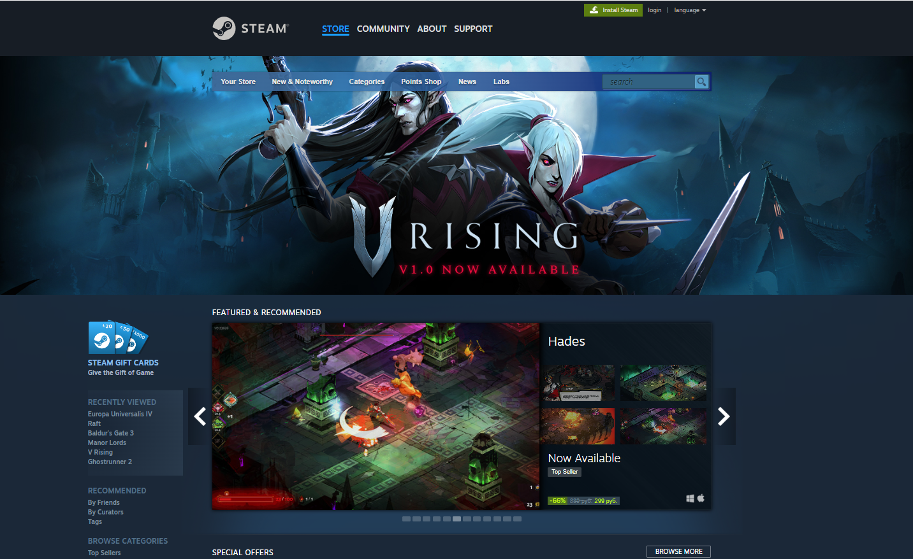
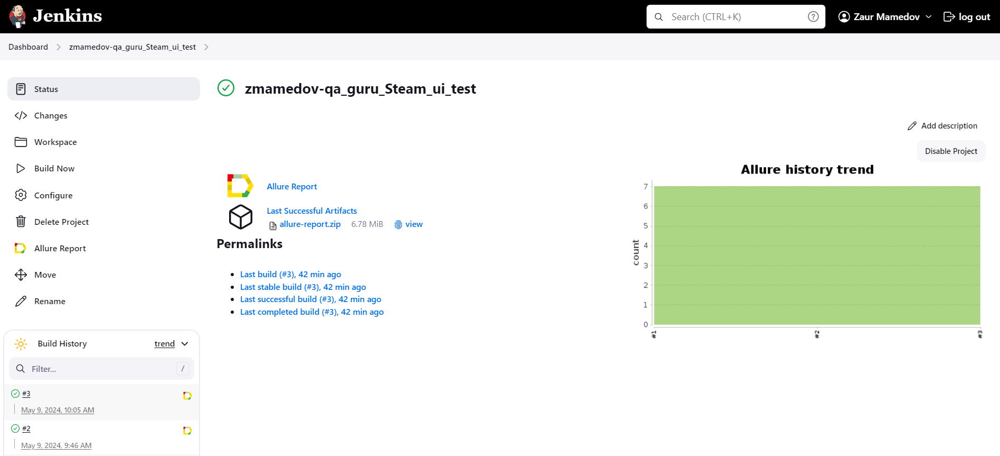
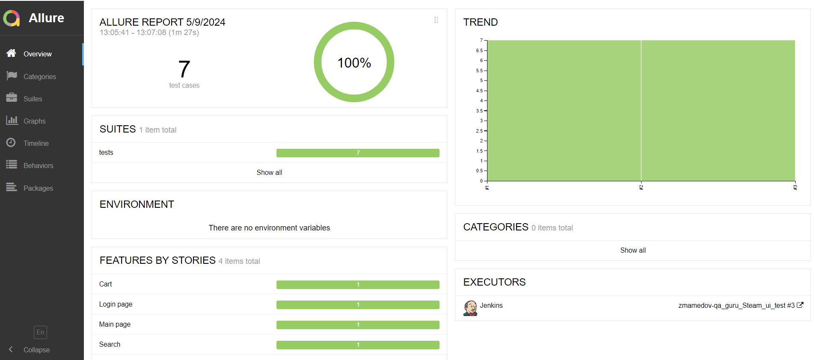
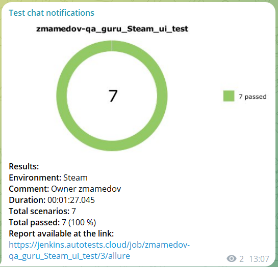

# Проект по тестированию интернет-магазина <a target="_blank" href="https://store.steampowered.com/">Steam</a>

---
### Список проверок, реализованных в web автотестах
1. Переход на вкладку "Community".
2. Смена языка на сайте на французский.
3. Поиск указанной игры.
4. Переход на страницу авторизации.
5. Добавление игры в корзину.
6. Удаление игры из корзины.
7. Очистка всей корзины.

---

### Используемые инструменты
        

---

### Запуск автотестов осуществляется с использованием Jenkins
> [Ссылка на сборку в Jenkins](https://jenkins.autotests.cloud/job/zmamedov-qa_guru_Steam_ui_test/)

#### Для запуска автотестов в Jenkins
1. Открыть [задачу в Jenkins](https://jenkins.autotests.cloud/job/zmamedov-qa_guru_Steam_ui_test/)

2. Нажать "**Build Now**".

---

### Allure отчет

---

### Уведомления в Телеграм

---

### Прохождение автотеста

